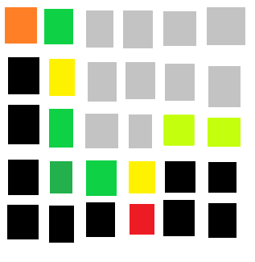

# Projekt-Jakub-Bohonos
## Projekt na informatykę-Minesweeper
Będzie to standardowa gra **Minesweeper**- Plansza 2D na której znajdują się kwadraty, które można kliknąć prawym albo lewym przyciskiem myszki. Będzie losowane, które kwadraty będą zawierać bomby. Kolor kwadratu po kliknięciu będzię pokazywał ile bomb jest wokół niego, na samym początku każdy kwadrat będzie mieć ten sam kolor. Jeśli gracz kliknie na kwadrat z bombą, przegrywa. Jeśli uda mu się wyczyścić planszę z wszystkich kwadratów bez bomb, wygrywa.Jeśli gracz myśli, że na danym polu jest bomba, może je zaznaczyć. 

Gra będzie się składać z poniższych klas:
- cScena-rysowanie planszy i sprawdzanie po kliknięciu kwadratu co się będzie dziać.
- cKwadrat-klasa zawierająca właściwości kwadratów na planszy oraz metody i funkcje z nimi związane.
- cFigura-klasa bazowa dla cKwadrat, zawierająca współrzędne kwadratów.

Szkic:

Podsumowanie szkicu(kolory są tylko przykładowe):
- Czarny- nieodkryte pola.
- Szary- odkryte już pola, bez żadnych min wokól siebie,
- Zielone, ciemnozielone, żółte-odkryte pola z różną ilością min wokół siebie, zależnie od koloru.
- Czerwone-odkryte pole z miną.
- Pomarańczowy- nieodkryte pole, zaznaczone przez gracza, który może umważać, że tam jest mina.

Podsumowanie sterowania:
- Lewy przycisk myszy-odkrycie pola.
- Prawy przycisk myszy-zaznaczenie nieodkrytego pola przez gracza, który może umważać, że tam jest mina(ponownie nacisnąć na pole aby odznaczyć).

Jeśli wokól naciśniętego pola znajdują się pola bez żadnych min wokól siebie to samoistnie się odkryją.

Wizualizacja będzie odzielona od silnika gry(pola są po prostu narysowane na planszy, a informacje związane z bombami i odkrytymi polami znajdują się w osobnych tablicach w programie).
